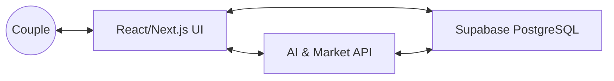

# OurGlass System Architecture

This repository follows a modern full-stack architecture optimized for Next.js, Supabase, and AI integration.

## Core Documentation

For an in-depth look at our architecture, please refer to the detailed guides in the `/docs` folder:

- **[System Overview](./docs/system-overview.md)**: High-level philosophy and project goals.
- **[Architecture Details](./docs/architecture.md)**: Technical breakdown of layers (Client, API, DB).
- **[Database Schema](./docs/database.md)**: Explanation of the Couple Model and RLS security.
- **[AI Agent (Roee)](./docs/ai-agent.md)**: How our Hebrew AI works and uses tools.
- **[Net Worth Engine](./docs/networth-engine.md)**: The calculation logic and single source of truth.

---

## High-Level Diagram

---

## Development Roadmap

- [x] Core Net Worth Engine
- [x] Hebrew AI Agent (Roee)
- [x] Multi-tenant Couple Model
- [x] Real-time Market Data
- [x] Wealth History Snapshotting
- [ ] Automated Financial Reports
- [ ] Bank Integration (Open Banking Israel)
